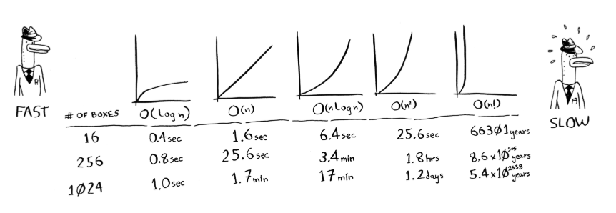

# grokking-js-algorithms

Grokking Algorithms implemented in javascript

## Common run times for algorithms

- O(n) - linear time
- O(log n) - logarithmic (log) time
- O(1) - constant time
- O(n \* log n)
- O(n^2)
- O(n!) - factorial time

## Important

- Algorithm speed isn’t measured in seconds, but in growth of the number of operations
- Instead, we talk about how quickly the run time of an algorithm increases as the size of the input increases
- Run time of algorithms is expressed in Big O notation
- Big O notation lets you compare the number of operations.
- Big O notation is about the worst-case scenario.

## Solve the logarithmic equation log₂(x) = 3

**Solution By Steps**
_Step 1: Convert the logarithmic equation to an exponential form_
To solve the logarithmic equation \(\log_2(x) = 3\), we need to convert it to an exponential form. The general conversion is:
\[
\log_b(a) = c \implies a = b^c
\]
For our specific equation \(\log_2(x) = 3\), we convert it to:
\[
x = 2^3
\]

_Step 2: Calculate the value of the exponential expression_
Now we calculate \(2^3\):
\[
2^3 = 8
\]

**Final Answer**
\(x = 8\)

**Key Concept**
Logarithmic and Exponential Relationship

**Key Concept Explanation**
A logarithm is the inverse operation of exponentiation. The logarithmic equation \(\log_b(a) = c\) means that the base \(b\) raised to the power of \(c\) gives the number \(a\). This can be rewritten in exponential form as \(a = b^c\). Understanding this relationship allows us to solve logarithmic equations by converting them into exponential equations and vice versa.

**Related Knowledge or Questions**
[1] Solve the logarithmic equation \(\log\_{10}(x) = 4\).
[2] Simplify the expression \(\log_2(32)\).
[3] Solve the exponential equation \(2^x = 16\).

Great job working on this problem! Feel free to choose one of the related questions to further deepen your understanding, or ask any other questions you might have. I'm here to help!

## Common database algorithms include

1. **Sorting Algorithms**:

   - QuickSort
   - MergeSort
   - HeapSort

2. **Searching Algorithms**:

   - Binary Search
   - Linear Search

3. **Indexing Algorithms**:

   - B-Tree
   - B+ Tree
   - Hash Indexing

4. **Join Algorithms**:

   - Nested Loop Join
   - Sort-Merge Join
   - Hash Join

5. **Query Optimization Algorithms**:

   - Cost-Based Optimization
   - Rule-Based Optimization

6. **Transaction Management Algorithms**:

   - Two-Phase Commit
   - Three-Phase Commit

7. **Concurrency Control Algorithms**:

   - Two-Phase Locking (2PL)
   - Timestamp Ordering
   - Multiversion Concurrency Control (MVCC)

8. **Data Compression Algorithms**:

   - Run-Length Encoding
   - Huffman Coding
   - Lempel-Ziv-Welch (LZW)

9. **Replication Algorithms**:

   - Synchronous Replication
   - Asynchronous Replication

10. **Backup and Recovery Algorithms**:
    - Incremental Backup
    - Differential Backup
    - Point-in-Time Recovery

These algorithms are fundamental to the operation, efficiency, and reliability of database systems.

## Other helpful github repos

- https://github.com/trekhleb/javascript-algorithms.git
- https://github.com/TheAlgorithms/JavaScript.git
- https://github.com/mgechev/javascript-algorithms.git
- https://github.com/loiane/javascript-datastructures-algorithms.git
