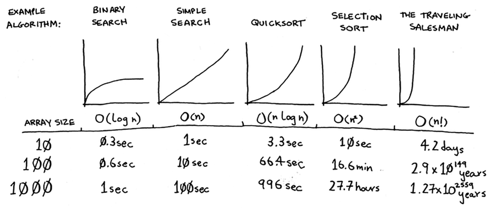

# grokking-js-algorithms

Grokking Algorithms implemented in javascript

## Common run times for algorithms

- O(n) - linear time
- O(log n) - logarithmic (log) time
- O(1) - constant time
- O(n \* log n)
- O(n^2)
- O(n!) - factorial time

Example:
n = 8
log(n) = 3
n log(n) = 24
n^2 = 64
n! = 40320

## Big O Notation

- Algorithm speed isn’t measured in seconds, but in growth of the number of operations
- Instead, we talk about how quickly the run time of an algorithm increases as the size of the input increases
- Run time of algorithms is expressed in Big O notation
- Big O notation lets you compare the number of operations
- Big O notation is about the worst-case scenario

## Arrays and Linked lists

|           | Arrays                                           | Lists                | Hybrid              |
| --------- | ------------------------------------------------ | -------------------- | ------------------- |
| Access    | random                                           | sequential           | random + sequential |
| Reads     | O(1)                                             | O(n)                 | O(log n + k)        |
| Insertion | O(n) _except pushing to the end in static array_ | O(1) _head and tail_ | O(log n + 1)        |
| Deletion  | O(n) _except removing the last item_             | O(1) _head and tail_ | O(log n + 1)        |

## Call Stack & Recursion

When using recursion, the items you're looking through is saved on the stack. Computers allocate memory on the stack for each function call

Recursion keeps track of the state

> p. 44 last paragraph where call stack is discussed reminds me of generators & iterators

## Divide & Conquer

1. Figure out a simple case and the base case
2. Figure out how to reduce your problem and get to the base case

## Euclid's algorithm & number theory, inductive proof, traveling salesman problem

## Hash tables: collisions, hash functions, load factor

## Graphs. Graph theory

Breadth-first search solves shortest path problem.
A graph has nodes (vertices) and edges. A node might have neighbors.
Directed graph - relationship is only one way.
An undirected graph means that both nodes point to each other. That’s a cycle.
Topological sort - If task A depends on task B, task A shows up later in the list. This is called a topological sort, and it’s a way to make an ordered list out of a graph.

## Dijkstra's Algorithm

Breadth-first search is used to calculate the shortest path for an unweighted graph.
Dijkstra’s algorithm is used to calculate the shortest path for a weighted graph.
Dijkstra’s algorithm works when all the weights are positive. You can’t use Dijkstra’s algorithm if you have negative-weight edges.
If you have negative weights, use the Bellman-Ford algorithm
Dijkstra’s algorithm only works with directed acyclic graphs, called DAGs for short.

1. Find the cheapest node
2. Figure out how long it takes to get to its neighbours (the cost)
3. Repeat step 1 and 2

## Solve the logarithmic equation log₂(x) = 3

**Solution By Steps**
_Step 1: Convert the logarithmic equation to an exponential form_
To solve the logarithmic equation \(\log_2(x) = 3\), we need to convert it to an exponential form. The general conversion is:
\[
\log_b(a) = c \implies a = b^c
\]
For our specific equation \(\log_2(x) = 3\), we convert it to:
\[
x = 2^3
\]

_Step 2: Calculate the value of the exponential expression_
Now we calculate \(2^3\):
\[
2^3 = 8
\]

**Final Answer**
\(x = 8\)

**Key Concept**
Logarithmic and Exponential Relationship

**Key Concept Explanation**
A logarithm is the inverse operation of exponentiation. The logarithmic equation \(\log_b(a) = c\) means that the base \(b\) raised to the power of \(c\) gives the number \(a\). This can be rewritten in exponential form as \(a = b^c\). Understanding this relationship allows us to solve logarithmic equations by converting them into exponential equations and vice versa.

**Related Knowledge or Questions**
[1] Solve the logarithmic equation \(\log\_{10}(x) = 4\).
[2] Simplify the expression \(\log_2(32)\).
[3] Solve the exponential equation \(2^x = 16\).

Great job working on this problem! Feel free to choose one of the related questions to further deepen your understanding, or ask any other questions you might have. I'm here to help!

## Common database algorithms include

1. **Sorting Algorithms**:

   - QuickSort
   - MergeSort
   - HeapSort

2. **Searching Algorithms**:

   - Binary Search
   - Linear Search

3. **Indexing Algorithms**:

   - B-Tree
   - B+ Tree
   - Hash Indexing

4. **Join Algorithms**:

   - Nested Loop Join
   - Sort-Merge Join
   - Hash Join

5. **Query Optimization Algorithms**:

   - Cost-Based Optimization
   - Rule-Based Optimization

6. **Transaction Management Algorithms**:

   - Two-Phase Commit
   - Three-Phase Commit

7. **Concurrency Control Algorithms**:

   - Two-Phase Locking (2PL)
   - Timestamp Ordering
   - Multiversion Concurrency Control (MVCC)

8. **Data Compression Algorithms**:

   - Run-Length Encoding
   - Huffman Coding
   - Lempel-Ziv-Welch (LZW)

9. **Replication Algorithms**:

   - Synchronous Replication
   - Asynchronous Replication

10. **Backup and Recovery Algorithms**:
    - Incremental Backup
    - Differential Backup
    - Point-in-Time Recovery

These algorithms are fundamental to the operation, efficiency, and reliability of database systems.

## Other helpful github repos

- https://github.com/trekhleb/javascript-algorithms.git
- https://github.com/TheAlgorithms/JavaScript.git
- https://github.com/mgechev/javascript-algorithms.git
- https://github.com/loiane/javascript-datastructures-algorithms.git
